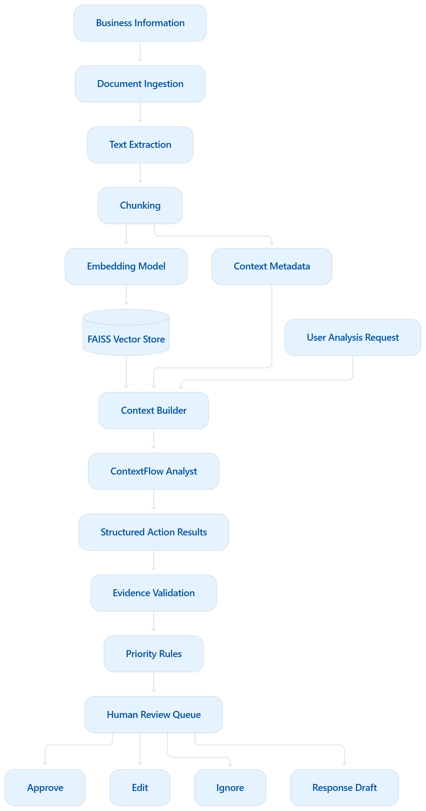

# ContextFlow

### From scattered business information to clear, evidence-backed next steps.

**ContextFlow is a prototype business context and action engine.** It brings related details from uploaded emails, invoices, contracts, policies, support tickets, and notes into one reviewable picture—then highlights potential issues, deadlines, supporting evidence, and sensible next steps for a person to assess.

> **The idea:** teams do not just need another place to store information. They need help connecting what they already know, seeing what may need attention, and understanding why. ContextFlow explores that missing context-to-action layer while keeping people responsible for decisions.

**Project status:** local prototype. The architecture diagram describes the broader product direction; integrations and automated actions shown or discussed as future possibilities are not implemented.

---

## Why this problem matters

Important business context is often spread across inboxes, shared folders, contracts, spreadsheets, support queues, and internal policies. Someone has to find the right records, compare them, notice what changed, work out what matters, and decide what to do next.

That manual coordination can mean repeated searches, duplicated effort, slow follow-ups, overlooked dates, and decisions made without the full picture. ContextFlow is designed to reduce that *information-gathering burden*: make relationships between records easier to inspect, bring potential work into a prioritized queue, and show the evidence behind each suggestion.

The goal is not to replace employees or existing business systems. It is to help people spend less time piecing together context and more time applying judgment, serving customers, and doing consequential work.

## The concept and its value

Many AI chat experiences answer a question about one prompt or one document. ContextFlow explores a more operational workflow:

1. **Gather context** from relevant business records.
2. **Connect related details**, such as an invoice, its contract, and the policy that governs review.
3. **Identify candidate issues or deadlines** using transparent rules, with optional AI assistance.
4. **Show the supporting source evidence and gaps** so a reviewer can check the reasoning.
5. **Prepare a next step** for a person to approve, edit, or ignore.

For example, in the included fictional Acme scenario, an invoice, service agreement, customer email, and finance policy provide enough context to flag a $600 difference for finance review and surface a contract renewal date. The prototype presents those as review suggestions; it does not issue a refund or contact the customer.

**The differentiating idea is traceable context, not autonomous action:** a useful suggestion should be connected to the records that support it, make missing information visible, and leave the decision with a human.

## Architecture vision

The diagram below illustrates the intended context-to-action flow. It is a **design diagram**, not a claim that every box or integration is already implemented. See [Current prototype](#current-prototype-what-works-today) for what runs now.



### Reading the diagram accurately

- The current app accepts **manual file uploads** and parses readable PDF, TXT, MD, JSON, and CSV files.
- Local retrieval uses **BM25 keyword search by default**. Optional Sentence Transformers and FAISS vector search can be enabled separately.
- The “ContextFlow Analyst” is an **optional configured LLM**, not a separately trained or autonomous model. Deterministic Python rules remain available without an API key.
- Evidence validation, invoice arithmetic, date handling, priority safeguards, and local review decisions are part of the prototype.
- Connected data sources, production identity, multi-user workflows, and external actions are future work.

## Current prototype: what works today

- Upload multiple supported business files (up to **10 MB per file**) and analyze them together.
- Extract and index readable text locally, with source-aware evidence chunks.
- Search evidence with local BM25 without requiring an LLM or downloading an embedding model.
- Apply deterministic checks for invoice discrepancies, finance thresholds, contract renewal dates, and open support follow-ups.
- Optionally ask a configured LLM for additional structured suggestions; keep suggestions only when their cited quotations can be verified against uploaded source text.
- Review a prioritized action queue, inspect source excerpts and missing information, and edit, approve, or ignore suggestions.
- Store source text, analysis, and review decisions in a local SQLite database.
- Load the synthetic Acme scenario or try the single-file example at [`data/sample_upload/acme_account_review.txt`](data/sample_upload/acme_account_review.txt).

Approvals, edits, and response drafts are **local prototype records only**. The app does not send messages, modify tickets, issue payments, or perform other external actions.

## Analysis modes

### Deterministic mode

Works without an API key. Local Python logic handles supported rules such as amount comparisons, configured policy thresholds, date normalization, and evidence-linked action generation. Results follow the implemented rules; this mode does not generate free-form LLM analysis.

### Optional LLM-assisted mode

An API key is optional. When configured, the app sends retrieved excerpts and analysis context to the selected compatible provider for supplemental suggestions. The app checks suggested quotations against the uploaded text before accepting those suggestions. Deterministic checks still handle the known arithmetic and rule-based cases.

**Privacy note:** configuring a hosted LLM means relevant excerpts from the files you analyze are transmitted to that provider. Use only data and a provider you are authorized to use. Without LLM settings, the app uses local deterministic analysis.

#### Configure Gemini locally (optional)

From PowerShell in the project folder, run the helper and enter a Gemini API key at its hidden prompt:

```powershell
.\scripts\set-gemini-key.ps1
```

The helper configures the Gemini OpenAI-compatible endpoint and model in the local `.env` file. Restart Streamlit after changing settings. Never paste an API key into source code, commit it, or share it in screenshots. For another compatible provider, configure `LLM_BASE_URL`, `LLM_API_KEY`, and `LLM_MODEL` in `.env` instead.

## Run locally on Windows

Open PowerShell in the project folder and run each command separately:

```powershell
python -m venv .venv
.\.venv\Scripts\Activate.ps1
python -m pip install -r requirements.txt
python -m streamlit run app.py
```

If PowerShell blocks virtual-environment activation, run this in the same terminal, then activate again:

```powershell
Set-ExecutionPolicy -ExecutionPolicy RemoteSigned -Scope Process
```

Open the **Local URL** printed by Streamlit, usually `http://localhost:8501`. To try the app, choose **Try the Acme demo** or upload the included sample file.

## A practical path toward a unified business system

ContextFlow could grow into a **read-oriented context layer** over existing tools, starting with carefully scoped integrations and adding write actions only behind explicit human approval. These are roadmap ideas—not current capabilities.

| Future connection | Potential context it could contribute |
| --- | --- |
| Gmail or Microsoft 365 | Customer conversations, commitments, requests, and follow-up history |
| Slack or Microsoft Teams | Internal decisions, handoffs, and discussion context |
| Google Drive or SharePoint | Policies, contracts, procedures, and shared documents |
| Salesforce or HubSpot | Customer ownership, account history, opportunities, and renewal context |
| Jira, Zendesk, or ServiceNow | Issue status, owners, service requests, and support history |
| ERP, billing, or finance platforms | Invoices, purchase orders, account status, and finance records |

An integration could reduce manual file collection and help connect information across departments. It would also introduce real responsibilities: provider permissions, data minimization, identity and access control, tenant isolation, audit trails, retention rules, rate limits, integration monitoring, and failure handling.

### Suggested implementation sequence

1. **Read-only connections:** start with one source and narrowly scoped permissions; show imported records and source attribution.
2. **Identity and governance:** add authentication, role-based access, workspace boundaries, consent, retention, and audit logging before handling multiple organizations.
3. **Reliable synchronization:** add incremental updates, deduplication, retries, monitoring, and clear handling of deleted or changed source records.
4. **Human-approved actions:** only after the read path is dependable, consider narrowly defined actions with previews, explicit confirmation, and a record of who approved them.
5. **Measure usefulness:** evaluate evidence quality, false positives, time-to-review, and user trust with representative, permissioned data before broad deployment.

## Boundaries: not implemented in this prototype

The following are explicitly **not implemented**:

- Gmail, Slack, WhatsApp, CRM, Jira, or other application integrations.
- Authentication, multi-user accounts, or organization/tenant isolation.
- Payments, real task execution, email sending, or autonomous API calls.
- Voice input or output, or OCR for image-only/scanned documents.
- Multiple agents, Kubernetes deployment, or Docker-based deployment.
- A production-grade complex database or a React frontend.

The app does not claim to save a measured amount of time or to be production-ready. Those outcomes require integration, security, usability, and evaluation work beyond this prototype.

## Safety, privacy, and known limits

- Recommendations are suggestions for human review, not instructions to act.
- Uploaded document text and analysis are persisted locally at `.contextflow/contextflow.sqlite3`; use **Clear local workspace** in the sidebar to remove saved workspace records.
- If an LLM is configured, relevant retrieved excerpts are sent to that provider. Otherwise, analysis remains local and deterministic.
- Scanned PDFs are not OCR-processed.
- Evidence confidence is a heuristic indicator of source support, **not** a calibrated probability of correctness.
- The demo dataset is synthetic. Do not upload sensitive or confidential records unless you are authorized and understand where configured LLM requests are processed.
- This repository is a prototype; no production deployment, security certification, or external integration is claimed.

## Tests

Run the automated test suite from the project folder:

```powershell
python -m pytest
```

Tests cover supported-file ingestion, retrieval, deterministic business rules, storage, and LLM error handling. No evaluation or accuracy percentage is claimed.

## Project structure

```text
ContextFlowAI/
├── app.py                         # Streamlit entry point
├── app/                           # Ingestion, retrieval, rules, analysis, storage
├── ui/                            # Dashboard, components, and styles
├── data/
│   ├── demo/                      # Synthetic multi-file scenario
│   └── sample_upload/             # Single-file sample for upload
├── docs/
│   ├── architecture.md            # Pipeline and trust boundaries
│   └── mermaid-diagram.png        # Architecture vision shown above
├── scripts/
│   └── set-gemini-key.ps1         # Secure local Gemini-key setup
├── tests/                         # Automated tests
├── .streamlit/                    # Streamlit configuration
├── .env.example                   # Safe configuration template (no key)
├── requirements.txt
└── requirements-rag.txt           # Optional local vector-search dependencies
```

---

**ContextFlow is a prototype of an idea:** help organizations move from scattered information to a shared, evidence-backed understanding of what may need attention—then let people decide what happens next.
