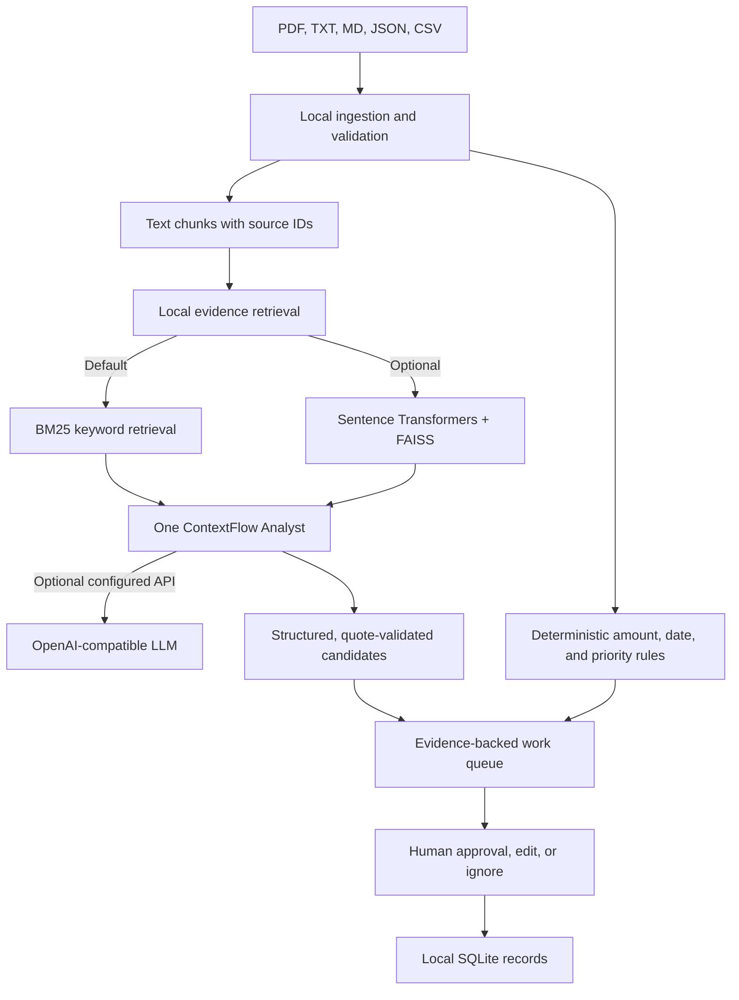

# ContextFlow architecture

## Trust boundaries

- Uploaded documents are parsed and indexed locally. Text-readable PDFs are supported; OCR is not.
- Keyword retrieval runs without model downloads. Optional embedding mode loads the configured Sentence Transformers model locally and indexes vectors in FAISS.
- When LLM variables are configured, only retrieved excerpts and candidate findings are sent to that configured endpoint. LLM suggestions are kept only when cited exact quotations are found in uploaded documents.
- Arithmetic, thresholds, deadline normalization, and known priority rules are implemented in Python.
- Approval, edits, and ignored states are local prototype records. No external action is executed.
- SQLite stores uploaded document text, analysis results, and action state under `.contextflow/`. Clear the workspace in the sidebar to remove those records.
